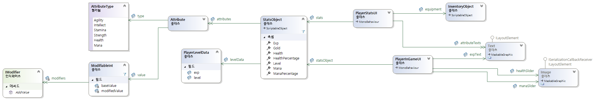
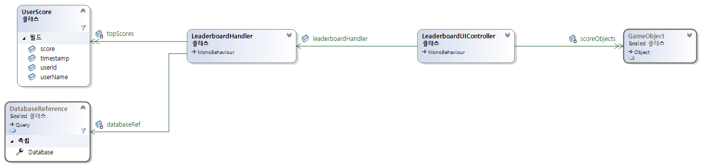
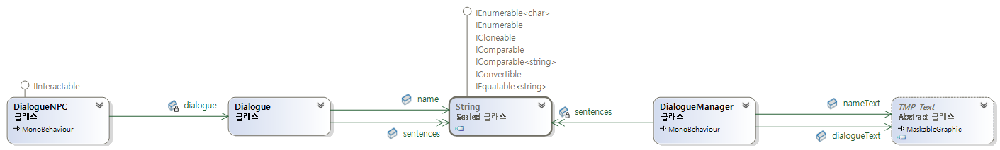
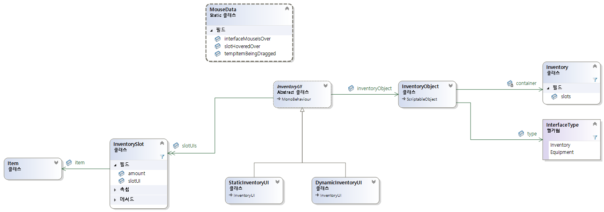
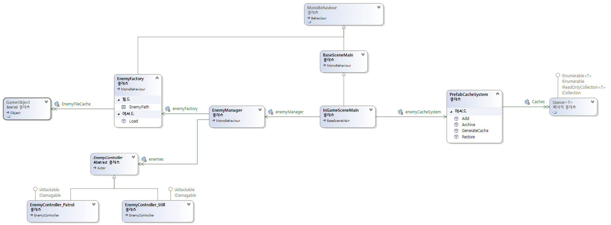

# ARPG ( 1인 개발, 2022.03.10 ~ 2022.10.12, C# )
## Action RPG
- [NPC Dialogue System](./ARPG/Assets/ARPG/DialogueSystem)  
  Dialogue Manager, Dialogue NPC
- [위아래로 움직이는 문 구현](./ARPG/Assets/ARPG/DoorSystem)  
  문 열림/닫힘
- [Firebase](./ARPG/Assets/ARPG/Firebase/Scripts)  
  사용자 인증, 순위(leaderboard), 사용자 데이터 저장/불러오기
- [Inventory System](./ARPG/Assets/ARPG/InventorySystem)  
  아이템, 인벤토리, 인벤토리 UI, 캐릭터 장비 교체, 아이템 사용 기능
- [Manager System](./ARPG/Assets/ARPG/ManagerSystem)  
  적 생성 관리자, System Manager
- [Prefab Cache System](./ARPG/Assets/ARPG/PrefabCacheSystem)  
  오브젝트 풀링(Pooling)
- [Quest System](./ARPG/Assets/ARPG/QuestSystem)  
  사냥 및 아이템 획득 퀘스트
- [Scene Controller System](./ARPG/Assets/ARPG/SceneControllerSystem)  
  씬 전환
- [Scripts](./ARPG/Assets/ARPG/Scripts)  
  플레이어 캐릭터(이동, 공격, 아이템 획득, 마우스 커서 UI)  
  적 캐릭터(이동, 공격, 감지, 체력 UI, 데미지 UI)  
  상태 머신, 3인칭 TopDown 카메라, 카메라 에디터 구현
- [Stats System](./ARPG/Assets/ARPG/StatsSystem)  
  플레이어 능력치, 플레이어 상태 UI
- [Table Marshal System](./ARPG/Assets/ARPG/TableMarshalSystem)  
  CSV 레코드 문자열을 구조체로 변환 후 자료 저장소에 기록
- [Trap System](./ARPG/Assets/ARPG/TrapSystem)  
  지속 데미지 함정


# ARPG 프로젝트 설명 영상
https://youtu.be/USFFC2Ag4UM


# 클래스 구조와 설명
<details>
<summary>캐릭터 능력치 시스템(Stats System)</summary>



### 발생 문제

1. **데이터 모델과 UI(View)의 강한 결합**
   - 플레이어 능력치(`StatsObject`) 변경 시, UI를 직접 갱신하거나 매 프레임 `Update()`에서 폴링(polling)하는 구조는  
     **불필요한 연산 낭비**와 **스파게티 코드**를 유발했습니다.  
   - 데이터 변경이 UI에 직접 연결되어 있어 **유지보수성 저하 및 의존성 증가** 문제 발생.

2. **아이템 장착 로직의 하드코딩**
   - 예:  
     ```csharp
     if (item.name == "Sword of Strength") { strength += 10; }
     ```
     이런 조건 기반 로직은 **개방-폐쇄 원칙** 을 위반하고,  
     새로운 아이템이나 버프 추가 시마다 **코드 수정이 필요**했습니다.

3. **데이터 영속성의 비효율성**
   - 단순 `PlayerPrefs` 기반 Key-Value 저장은 **객체 구조 데이터(레벨, 경험치 등)** 를 온전히 저장할 수 없었고,  
     저장 중 오류 발생 시 **데이터 손상 위험**이 있었습니다.

---

### 해결 방법

1. **옵저버 패턴 도입**
   - `StatsObject`는 능력치 변경 시 **이벤트(Action<StatsObject> OnChangedStats)** 를 발행합니다.  
   - UI(`PlayerStatsUI`, `PlayerInGameUI`)는 이벤트를 **구독** 하여  
     상태가 변경될 때만 UI를 자동 갱신합니다.  
   - 결과적으로 **데이터와 UI 간 결합이 제거**되어, 완전한 관심사 분리를 달성했습니다.  

2. **전략 패턴 및 컴포지션 기반 설계**
   - `ModifiableInt`는 기본값(`baseValue`)과 수정자 리스트(`List<IModifier>`)를 함께 관리합니다.  
   - 아이템 장착/해제 시, `PlayerStatsUI`는 단순히 다음과 같은 형태로만 작동합니다:  
     ```csharp
     attribute.value.AddModifier(buff);
     attribute.value.RemoveModifier(buff);
     ```
   - 각 IModifier는 고유의 능력치 변화 로직을 구현하며,  
     `ModifiableInt.UpdateModifiedValue()`가 이를 순회하며 결과를 집계합니다.  
     → 능력치 변경 로직이 완전히 캡슐화되어 있습니다.  

   - 새로운 버프나 아이템이 추가되어도 기존 코드를 수정할 필요 없이 확장 가능한 구조를 구현했습니다.  

3. **구조적 데이터 직렬화**
   - `PlayerLevelData`를 DTO(Data Transfer Object)로 사용하고, Newtonsoft.Json 기반 `ToJson()` / `FromJson()` 메서드로 직렬화 및 역직렬화를 수행했습니다.  
   - 단순 텍스트 파일 저장뿐 아니라 네트워크 전송 및 플랫폼 간 호환성도 확보했습니다.  
   - 기존 `PlayerPrefs` 기반 구조보다 안전하고 일관된 데이터 영속성 확보.  

---

### 실패 과정 및 교훈

- **Modifier 누적 오류**  
  초기 구현에서는 이전 수치를 초기화하지 않고 단순히 덧셈 누적 →  
  버프 효과가 무한 중첩되는 버그 발생.  
  → `baseValue`를 기준으로 모든 Modifier 재계산 구조로 개선.  

---

### 최종 문제 해결 요약
| 문제 영역 | 해결 전략 | 구현 방법 |
|------|------|--------------|
| 데이터-UI 결합 | 옵저버 패턴 | `OnChangedStats` 이벤트로 통신 |
| 능력치 확장성 | 전략 패턴 / 컴포지션 | `IModifier` 객체를 `ModifiableInt`에 등록 |
| 데이터 저장 | 구조적 직렬화 | `PlayerLevelData` + Newtonsoft.Json |

---

### 성과

- **CPU 효율성 향상**  
  - 기존 폴링 방식: UI 요소 K개일 때 매 프레임 O(K)  
  - 이벤트 기반 방식: 변경 발생 시에만 O(K) → 불필요한 연산 제거  

- **확장성 확보**  
  - 새로운 스탯, 버프, 아이템 추가 시 기존 코드 수정 불필요  

- **데이터 안정성 강화**  
  - JSON 직렬화를 통한 데이터 무결성 보장  

- **유지보수성 향상**  
  - 관심사 분리 및 느슨한 결합 구조로 코드 가독성 및 관리 용이성 확보  

</details>


<details>
<summary>Firebase 기반 리더보드 시스템</summary>



### 발생 문제

1. **비동기 처리와 메인 스레드 제약**
   - Unity의 `Update()` 루프는 **메인 스레드**에서만 실행되며,  
     Firebase의 `GetValueAsync()` / `SetValueAsync()` 등은 **별도 스레드**에서 완료됩니다.  
     → 비동기 콜백에서 직접 Unity API(`UI`, `GameObject` 등)를 호출하면 **스레드 충돌 예외**가 발생했습니다.
   - 따라서 **비동기 작업 결과를 메인 스레드로 안전하게 되돌릴 브리징 로직**이 필요했습니다.

2. **Firebase 쿼리의 한계**
   - Firebase Realtime Database는 NoSQL 구조로,  
     `DISTINCT`, `GROUP BY` 같은 SQL식 집계 쿼리를 지원하지 않습니다.  
     → 단순히 상위 N개의 점수를 요청하면, **한 유저의 다수 기록이 리더보드를 독점**하는 문제가 발생했습니다.

3. **실시간 동기화 정합성 문제**
   - `ChildAdded` 이벤트를 바로 등록하면,  
     초기 로딩 시점과 실시간 이벤트가 **중첩 처리되어 중복 데이터**나 **순서 꼬임**이 발생했습니다.

4. **UI 갱신 시 성능 저하**
   - 리더보드 데이터가 갱신될 때마다 UI 프리팹을 생성/파괴하자  
     **GC(가비지 컬렉션) 부하**로 인해 프레임 드랍이 발생했습니다.

---

### 해결 방법

#### 1. Task 기반 비동기 처리 + 메인 스레드 브리지
- `ContinueWith()` 내부에서는 **Unity API를 직접 호출하지 않고**,  
  단지 결과를 저장하고 Boolean 플래그(`sendAddedScoreEvent`, `sendUpdatedLeaderboardEvent` 등)를 `true`로 설정합니다.
- `Update()` 루프에서 이 플래그를 감지해 **메인 스레드에서 이벤트를 안전하게 호출**합니다.

이 구조는 **비동기(Firebase 콜백)** 와 **Unity 메인 스레드** 사이의 완벽한 브리지 역할을 수행합니다.


#### 2. 클라이언트 집계 + 페이지네이션
- Firebase의 단일 쿼리 한계를 보완하기 위해 **클라이언트 단에서 데이터 필터링 및 병합 처리**를 수행했습니다.
- `GetInitialTopScores()` 메서드:
  - 점수 기준으로 Firebase 데이터를 **페이지 단위로 요청**
  - 각 페이지에서 유니크한 유저별 최고 점수만 선별 후 `Dictionary<string, UserScore>` 에 저장
  - 목표 유저 수(`scoresToRetrieve`)에 도달할 때까지 **재귀 호출**로 다음 페이지 요청
  - 모든 페이지 병합 후 정렬 → `List<UserScore> topScores` 구성


#### 3. 원자적 상태 전환 + 멱등적 병합
- **초기 데이터 로딩이 완전히 끝난 뒤에만** 실시간 이벤트(`ChildAdded`)를 등록하도록 변경.  
  → 초기 로딩과 실시간 이벤트 간의 **경쟁 상태(Race Condition)** 제거.
- `OnScoreAdded()`:
  - 동일 유저가 이미 더 좋은 점수를 보유한 경우 교체하지 않음.  
  - 중복 항목 제거 + 리스트 크기 유지 + 정렬 보존.  
  - 결과는 항상 동일 → **멱등성** 확보.


#### 4. UI 최적화 — 오브젝트 풀링(Object Pooling)
- `LeaderboardUIController.CreateTopscorePrefabs()`에서 **미리 지정된 개수(MaxRetrievableScores)** 만큼 UI 프리팹을 생성.
- 이후에는 오브젝트를 파괴하지 않고,  
  `SetActive(true/false)` 로 표시만 제어 → **GC 발생 최소화 + 프레임 안정화** 달성.

---

### 실패 과정 및 교훈

1. **비동기 콜백에서 Unity API 직접 호출**  
   → 메인 스레드 전용 API 예외 발생 → `Update()` 기반 브리지 방식으로 교정.  
2. **단일 쿼리 상위 N개 요청**  
   → 동일 유저의 다중 점수로 리더보드 왜곡 → 페이지네이션 + 유니크 필터 도입.  
3. **실시간 이벤트 중복 병합 문제**  
   → 단순 리스트 추가에서 교체 로직 및 정렬 유지 방식으로 개선.

---

### 최종 문제 해결 요약

| 문제 영역 | 해결 전략 | 핵심 구현 포인트 |
|------------|------------|------------------|
| 비동기 스레드 충돌 | Update() 기반 브리지 | 이벤트 플래그를 통해 메인 스레드에서 호출 |
| Firebase 쿼리 한계 | 클라이언트 집계 | Dictionary로 유저별 최고 점수 선별 |
| 실시간 동기화 문제 | 원자적 상태 전환 | 초기 로딩 완료 후 실시간 구독 시작 |
| UI 성능 저하 | 오브젝트 풀링 | 프리팹 재사용으로 GC 최소화 |

---

### 성과

- **데이터 일관성 향상:**  
  중복/경쟁 상태 제거 → 항상 올바른 리더보드 유지  

- **공간 복잡도 감소:**  
  전체 데이터 보관(O(N)) → 상위 K개만 유지(O(K))

- **네트워크 효율 향상:**  
  필요한 만큼 페이지 단위 요청 → **대역폭 절감 + 로딩 속도 향상**

- **UI 퍼포먼스 안정화:**  
  오브젝트 풀링으로 GC 발생 최소화, 부드러운 스크롤 및 업데이트 유지

</details>


<details>
<summary>NPC Dialogue System</summary>



### 발생 문제
1. **복잡한 상태 관리**  
   초기 구현에서는 `string[]` 배열과 인덱스를 이용해 대화 문장을 순차적으로 출력했습니다.  
   그러나 현재 대화가 몇 번째 문장인지 추적해야 하며, 인덱스 관리 실수로 인한 버그 발생 위험이 높았습니다.  

2. **모듈 간 강한 결합**  
   `DialogueManager`, `DialogueNPC`, `PlayerCharacter` 간의 통신이 직접 함수 호출로 이루어져,  
   한 모듈의 변경이 다른 모듈에 **직접적인 영향**을 주는 구조였습니다.  
   이는 유지보수를 어렵게 만들고, 시스템 간 **결합도** 를 불필요하게 높였습니다.

3. **비동기 처리 부재**  
   텍스트 타이핑 효과를 동기식 방식으로 처리할 때,  
   대화 중 다른 게임 로직이 일시 정지되는 **프로세스 블로킹 현상**이 발생했습니다.

---

### 해결 방법
1. **큐(Queue) 기반의 순차 처리 구조**  
   `Queue<string>`을 사용하여 대화 문장을 **선입선출(FIFO)** 원리로 관리했습니다.  
   이로써 문장의 순서 보장이 간단해지고, 인덱스 관리가 불필요해졌습니다.

2. **이벤트/델리게이트 기반 통신 구조**  
   `DialogueManager`가 **이벤트 발행자(publisher)** 로서  
   `OnStartDialogue`, `OnEndDialogue` 이벤트를 외부로 전달하고,  
   `DialogueNPC`는 이를 **구독(subscribe)** 하여 필요한 동작만 수행합니다.  
   이로써 각 모듈은 서로의 내부 구현을 몰라도 통신할 수 있는 **느슨한 결합** 구조가 완성되었습니다.

3. **비동기 코루틴(Coroutine) 도입**  
   `TypeSentence()`를 `IEnumerator` 기반의 **코루틴**으로 구현하여  
   `yield return null`을 통해 매 프레임 한 글자씩 출력하는 비동기 타이핑 효과를 구현했습니다.  
   이 방식은 메인 스레드를 차단하지 않으며, 게임의 다른 요소와 동시에 자연스럽게 실행됩니다.

---

### 실패 과정
- 이벤트 등록 시 `=` 연산자를 사용하여 구독자를 덮어쓰는 실수를 했습니다.  
  → 올바른 방식은 `+=` 연산자를 사용해 **구독자를 추가 등록**해야 합니다.  
- 코루틴 도입 전, `while` 루프와 `Time.deltaTime` 계산을 통해 직접 텍스트 타이핑 속도를 제어하려 했으나  
  오히려 코드가 복잡해지고 제어 타이밍이 불안정해졌습니다.  
  → Unity의 **코루틴 기반 비동기 루프**가 훨씬 단순하고 안정적인 해결책이었습니다.

---

### 최종 문제 해결
- **Queue<string>** 으로 대화 문장 순서를 간단하고 안정적으로 관리  
- **이벤트 기반 통신 구조**로 시스템 간 의존성 최소화  
- **코루틴 기반 타이핑 효과**로 비동기적 텍스트 표시 및 메인 스레드 블로킹 제거  

또한,  
- `DialogueManager`는 대화의 흐름 제어와 이벤트 발행만 담당  
- `DialogueNPC`는 플레이어 입력에 따라 대화를 시작하거나 종료하는 역할만 수행  

---

### 성과
- **시간 복잡도:**  
  - `DisplayNextSentence()` → `Queue.Dequeue()` : O(1)  
  - 이벤트 호출 및 등록 → O(1)  

- **결합도 감소:**  
  - 유지보수 및 기능 확장 용이

- **비동기 처리 개선:**  
  - 코루틴 기반 타이핑 효과로 **프레임 멈춤 없는 자연스러운 연출** 구현  
  - UI 애니메이션, 입력 차단, 이벤트 흐름이 유기적으로 동작

</details>


<details>
<summary>Inventory System</summary>



### 발생 문제
기존 인벤토리 시스템은 **강한 결합도**로 인해 유지보수가 어려웠습니다.  
데이터(인벤토리 상태), UI 표현, 사용자 입력 처리가 하나의 거대한 클래스 안에 뒤섞여 있었기 때문에  
특정 기능을 수정할 때 전체 시스템에 **예기치 못한 부작용**이 발생했습니다.  

또한, 입력 처리가 **매 프레임 폴링(polling)** 방식으로 이루어져  
`Update()` 내에서 마우스 클릭 및 UI 충돌을 지속적으로 검사하는 비효율적인 구조로 인해  
불필요한 **CPU 연산 낭비**와 성능 저하가 발생했습니다.

---

### 해결 방법
근본적인 해결을 위해 **MVC(Model–View–Controller)** 디자인 패턴을 적용했습니다.  
각 책임을 명확히 분리하여 시스템 복잡도를 낮추고 확장성을 확보했습니다.

- **모델(Model)**  
  - 인벤토리의 **데이터 및 비즈니스 로직**을 담당.  
  - `InventoryObject`가 이 역할을 수행하며, 아이템 추가·제거·교환 등의 핵심 로직을 포함.  
  - UI나 입력 로직에 의존하지 않으며, 완전한 데이터 독립성을 가집니다.

- **뷰(View)**  
  - 인벤토리 데이터를 **시각적으로 표현**하는 레이어.  
  - Unity의 UI 컴포넌트(`Image`, `TextMeshProUGUI`)와 `EventSystem`이 여기에 해당합니다.  
  - 데이터의 변경 사항을 직접 수정하지 않고, **표시만 담당**합니다.

- **컨트롤러(Controller)**  
  - 사용자 입력을 받아 모델의 상태를 변경하거나 UI의 표시를 갱신.  
  - `InventoryUI` 및 그 파생 클래스(`StaticInventoryUI`, `DynamicInventoryUI`)가 이 역할을 담당.  
  - `EventTrigger`를 통해 뷰로부터 마우스 이벤트를 수신하고, 모델의 메서드를 호출합니다.

---

### 실패 과정
MVC 패턴 도입 초기에는 **모델과 컨트롤러 간의 경계가 모호**했습니다.  
`InventoryUI` 내부에서 슬롯 데이터를 직접 관리하려다 보니  
여러 UI 인스턴스가 **동일한 인벤토리 데이터를 비일관적으로 다루는 문제**가 발생했습니다.  

또한, 컨트롤러가 매 프레임 모델 상태를 확인하는 비효율적인 구조를 사용했습니다.  
이를 통해 결국 **이벤트 기반(Observer Pattern)** 아키텍처의 필요성을 인식하게 되었습니다.

---

### 최종 문제 해결
- **MVC 패턴의 명확한 역할 분리**
  - `InventoryObject` → 모델  
  - `InventoryUI` → 컨트롤러  
  - `Unity UI + EventSystem` → 뷰  
  - 각 계층이 명확히 분리되어, 수정 시 영향 범위가 최소화되었습니다.

- **이벤트 기반 구조(Observer Pattern)**
  - `InventorySlot.OnPostUpdate` 이벤트를 활용해,  
    모델의 데이터 변경 시 컨트롤러가 자동으로 통지받아 뷰를 갱신하도록 구현.  
  - 매 프레임 폴링 없이, **변경 시점에만 로직 실행**.

- **상속 기반 확장성 확보**
  - `InventoryUI`를 추상 클래스로 정의하고,  
    고정 슬롯 기반의 `StaticInventoryUI`와  
    런타임 동적 생성 기반의 `DynamicInventoryUI`를 파생시킴.  
  - 새로운 UI 형태가 필요할 경우, **InventoryUI 상속만으로 기능 확장 가능**.

- **이벤트 트리거 등록 방식 개선**
  - `AddEvent()` 메서드로 `EventTrigger`에 동적으로 델리게이트를 연결하여  
    입력 발생 시점에만 처리 수행 → **불필요한 CPU 사용 제거**.

---

### 성과
- **관심사 분리** 달성 → 유지보수성 대폭 향상  
- 데이터 로직 수정 시 UI 영향 최소화  
- 매 프레임 검사 제거로 CPU 부하 감소 → **반응성 향상**  
- 추상화된 UI 구조를 통한 **확장성 확보**

</details>


<details>
<summary>Prefab Cache System</summary>



### 발생 문제
대규모의 오브젝트를 **동적으로 생성 및 파괴**하는 과정에서 성능 저하가 발생했습니다.  
이는 **빈번한 메모리 할당 및 해제**로 인해 GC(Garbage Collection) 오버헤드가 증가하고,  
힙 메모리의 **단편화** 를 유발하여 전체적인 퍼포먼스 저하를 초래했습니다.

---

### 해결 방법
객체를 생성/파괴하지 않고 **재활용하는 오브젝트 풀링(Object Pooling)** 기법을 도입했습니다.  
즉, 사용하지 않는 객체를 비활성화 상태로 **메모리에 유지**하고, 필요 시 재활성화하여 사용하는 방식입니다.  

---

### 실패 과정
초기에는 단순한 **리스트(List)** 나 **배열(Array)** 을 사용하여 풀을 구성했습니다.  
그러나 특정 객체를 다시 사용할 때마다 전체 리스트를 순회해야 하므로,  
**O(N)**의 탐색 시간이 발생해 풀링의 장점을 살리지 못했습니다.

---

### 최종 해결책
**Dictionary + Queue** 구조를 결합하여 효율적인 풀링 시스템을 구현했습니다.

- **Dictionary<string, Queue<GameObject>> Caches**
  - 프리팹 경로(`filePath`)를 키로 하여 각 프리팹 타입별 큐를 관리.
  - 해시 테이블 기반의 딕셔너리로 **평균 O(1)** 접근 시간 보장.

- **Queue<GameObject>**
  - 각 프리팹 유형별 객체들은 **선입선출(FIFO)** 방식으로 저장.
  - `Dequeue()` 및 `Enqueue()` 모두 **O(1)** 시간 복잡도.

- **Archive()**
  - 큐에서 비활성화된 객체를 꺼내 위치 및 회전을 설정하고 활성화.

- **Restore()**
  - 사용 완료된 객체를 비활성화하여 다시 큐에 반환.

---

### 성과
- **객체 생성/소멸 비용 제거**   
- **디스크 I/O 및 GC 빈도 감소 → FPS 안정화 향상**  

</details>


  
  
<br>
<h1 align="center">ARPG 게임의 기능에 대해 핵심 코드 기반 설명</h1>

## 기능명 : 시야 인식
### 기능 설명
이 기능는 주어진 시야 반경(viewRadius) 내에 존재하는 적(target)을 검색하고, 시야각(viewAngle)과 장애물(obstacleMask)을 고려하여 가장 가까운 살아있는 적(nearestTarget)을 찾는 기능입니다.

### 핵심 코드 1: 기본적인 적 검색
```csharp
Collider[] targetsInViewRadius = Physics.OverlapSphere(transform.position, viewRadius, targetMask);
```
- Physics.OverlapSphere 함수를 사용하여 현재 위치(transform.position)를 중심으로 시야 반경(viewRadius) 내에 있는 모든 콜라이더를 검색합니다.
- 검색 대상은 targetMask에 해당하는 레이어에 속한 오브젝트들입니다.

### 핵심 코드 2: 시야각과 장애물 적용
```csharp
if (Vector3.Angle(transform.forward, dirToTarget) < viewAngle / 2)
{
    // ...
    if (!Physics.Raycast(transform.position, dirToTarget, dstToTarget, obstacleMask))
    {
        // ...
    }
}
```
- 단순히 Unity에서 제공하는 편의 함수인 Vector3.Angle 함수를 사용하여 자신의 정면(transform.forward)과 적(target)까지의 방향(dirToTarget) 벡터 사이의 각도를 계산합니다.
- 이 각도가 시야각(viewAngle)의 절반(viewAngle / 2)보다 작으면 시야에 포함됩니다.
- Physics.Raycast 함수를 사용하여 자신과 적 사이에 장애물이 있는지 검사합니다.
- 검사 대상은 obstacleMask에 해당하는 레이어에 속한 오브젝트들입니다.


## 기능명 : State Machine
### 기능 설명
State Machine은 상태 패턴을 활용하였으며 여러 상태(State)를 가지고 있고, 
각 상태는 State Machine이 가지고 있는 데이터와 함께 작동합니다.
또한, State Machine은 상태를 추가, 업데이트, 변경할 수 있으며 
상태 변경할 때 변경된 상태에 따라 필요한 작업을 수행합니다.

### 핵심 코드 1: 상태(State) 객체를 추가
```csharp
state.SetMachineAndContext(this, context);
states[state.GetType()] = state;
```
- 전달받은 State 객체의 SetMachineAndContext 메서드를 호출하여 해당 State 객체에 StateMachine 객체와 Context 객체를 설정합니다.
- 설정된 State 객체를 State Machine의 states 딕셔너리에 추가합니다. 이때 Key 값으로는 State 객체의 Type을 사용하고, Value 값으로는 설정된 State 객체를 사용합니다.

### 핵심 코드 2: State Machine의 현재 상태(currentState)를 업데이트
```csharp
elapsedTimeInState += deltaTime;

currentState.PreUpdate();
currentState.Update(deltaTime);
```
- elapsedTimeInState 변수에 deltaTime을 더하여 현재 상태에서 경과된 시간을 계산합니다.
- currentState.PreUpdate() 함수를 호출하여 현재 상태의 PreUpdate 작업을 수행합니다. 
- currentState.Update(deltaTime) 함수를 호출하여 현재 상태의 Update 작업을 수행합니다.

### 핵심 코드 3: 새로운 상태로 상태 변경
```csharp
currentState = states[newType];
currentState.OnEnter();
elapsedTimeInState = 0.0f;
```
- State Machine의 currentState에 새로운 상태로 설정합니다.
- 새로운 상태의 OnEnter 함수를 호출하여, 해당 상태에 진입함을 처리합니다.
- elapsedTimeInState 변수를 0으로 설정하여 새롭게 변경된 현재 상태에서 경과된 시간을 0으로 초기화합니다.


## 기능명 : 거미 몬스터 공격 스킬
### 기능 설명
Target을 따라다니는 발사체를 발사하는 스킬입니다.

### 핵심 코드 1: Target 자동 추적
```csharp
protected override void FixedUpdate()
{
    if (target)
    {
        Vector3 dest = target.transform.position;
        dest.y += 1.5f;
        transform.LookAt(dest);
    }

    // ...
}
```
- 만약 target이 존재한다면 target의 위치를 받아옵니다.
- 발사체가 따라가야 할 target의 위치는 발밑이기 때문에 가슴 정도의 높이 값으로 설정합니다.
- 프레임마다 발사체가 바라보는 방향으로 이동할 것이므로 재조정된 target 위치를 바라보도록 했습니다.

### 핵심 코드 2: Hit effect가 생성될 위치와 Rotation 계산
```csharp
ContactPoint contact = collision.contacts[0];
Quaternion contactRotation = Quaternion.FromToRotation(Vector3.up, contact.normal);
Vector3 contactPosition = contact.point;
```
- collision에서 최초의 ContactPoint을 가져옵니다.
- Hit effect가 잘 보이게끔 Vector3.up 방향에서부터 충돌 지점의 법선 벡터 방향으로의 Rotation을 구합니다.
- 충돌 지점(contact)의 위치를 가져옵니다.

### 핵심 코드 3: 명중 시 발사체의 파티클 소멸
```csharp
while (transform.GetChild(0).localScale.x > 0)
{
    yield return new WaitForSeconds(0.01f);
    transform.GetChild(0).localScale -= new Vector3(0.1f, 0.1f, 0.1f);
    for (int i = 0; i < childs.Count; i++)
    {
        childs[i].localScale -= new Vector3(0.1f, 0.1f, 0.1f);
    }
}
```
- 발사체의 파티클이 부드럽게 서서히 줄어드는 효과가 연출됩니다.


## 기능명 : 플레이어 공격 스킬 
### 기능 설명
랜덤 움직임을 갖는 발사체를 부채꼴 형태로 다중 발사하는 스킬입니다.

### 핵심 코드 1: 부채꼴 형태로 다중 발사
```csharp
float totalAngle = stepAngle * (projectileCount - 1);
for (int i = 0; i < projectileCount; i++)
{
    // ...

    projectileGO.transform.Rotate(0, totalAngle / 2 - stepAngle * i, 0);

    // ...
}
```
- 발사체들이 부채꼴 호의 끝점에서 반대 끝점까지 일정한 간격(stepAngle)으로 나눠서 발사하게 됩니다.

### 핵심 코드 2: 발사체의 랜덤 움직임
```csharp
int randomSign = Random.Range(0, 3) - 1;
transform.localEulerAngles += Vector3.up * moveAngle * randomSign;
```
- 발사체가 일정 시간이 지나면 회전값들(-moveAngle, 0, moveAngle)중에서 랜덤으로 골라 무작위로 움직이게 됩니다.


## 기능명 : Record Line Parsing
### 기능 설명
입력받은 문자열(line)을 바이트 배열로 변환한 후, 이를 구조체로 변환하는 기능입니다. 이 과정에서 마샬링(marshalling)이 이루어집니다.

### 핵심 코드 1: int 타입의 바이트 배열로 변환
```csharp
fieldByte = BitConverter.GetBytes(int.Parse(splite));
```
- int 타입일 경우, BitConverter.GetBytes 함수를 사용하여 int.Parse 함수로 파싱된 값을 해당 타입의 바이트 배열로 변환합니다.

### 핵심 코드 2: float 타입의 바이트 배열로 변환
```csharp
fieldByte = BitConverter.GetBytes(float.Parse(splite));   
```
- float 타입일 경우, BitConverter.GetBytes 함수를 사용하여 float.Parse 함수로 파싱된 값을 해당 타입의 바이트 배열로 변환합니다.

### 핵심 코드 3: bool 타입의 바이트 배열로 변환
```csharp
bool value = bool.Parse(splite);
int temp = value ? 1 : 0;

fieldByte = BitConverter.GetBytes((int)temp);
```
- bool 타입일 경우, bool.Parse 함수를 사용하여 문자열을 bool 타입으로 파싱합니다.
- bool 타입의 값을 int 타입으로 변환하기 위해, 삼항 연산자를 사용하여 true일 경우 1, false일 경우 0으로 값을 변환합니다.
- 변환된 값을 BitConverter.GetBytes 함수를 사용하여 int 타입의 바이트 배열로 변환합니다.

### 핵심 코드 4: string 타입의 바이트 배열로 변환
```csharp
fieldByte = new byte[MarshalTableConstant.charBufferSize]; 
byte[] byteArr = Encoding.UTF8.GetBytes(splite);  

Buffer.BlockCopy(byteArr, 0, fieldByte, 0, byteArr.Length);
```
- string 타입일 경우, Encoding.UTF8.GetBytes 함수를 사용하여 해당 문자열을 UTF-8 형식의 바이트 배열로 변환합니다.
- 변환된 바이트 배열을 Buffer.BlockCopy 함수를 사용하여 fieldByte 배열에 복사합니다.
(MarshalTableConstant.charBufferSize는 최대 크기로 256으로 잡았고, 마샬링을 하기 위한 고정크기 버퍼를 생성하려고 존재합니다.)

### 핵심 코드 5: Marshal 메모리 할당
```csharp
int size = Marshal.SizeOf(typeof(T));
IntPtr ptr = Marshal.AllocHGlobal(size);
```
- Marshal.SizeOf 함수를 사용하여 T 타입의 크기를 구합니다.
- Marshal.AllocHGlobal 함수를 사용하여 해당 크기만큼의 Marshal 메모리를 할당합니다.

### 핵심 코드 6: 데이터 복사
```csharp
Marshal.Copy(bytes, 0, ptr, size);
```
- Marshal.Copy 함수를 사용하여 bytes 배열에서 size 만큼 데이터를 복사합니다.
복사된 데이터는 ptr 포인터가 가리키는 메모리 영역에 저장됩니다.

### 핵심 코드 7: 구조체로 변환
```csharp
T tStruct = (T)Marshal.PtrToStructure(ptr, typeof(T));
```
- Marshal.PtrToStructure 함수를 사용하여 ptr 포인터가 가리키는 메모리 영역에 있는 데이터를 T 타입의 구조체로 변환합니다.

### 핵심 코드 8: 메모리 해제
```csharp
Marshal.FreeHGlobal(ptr);
```
- Marshal.FreeHGlobal 함수를 사용하여 ptr 포인터가 가리키는 메모리를 해제합니다.


